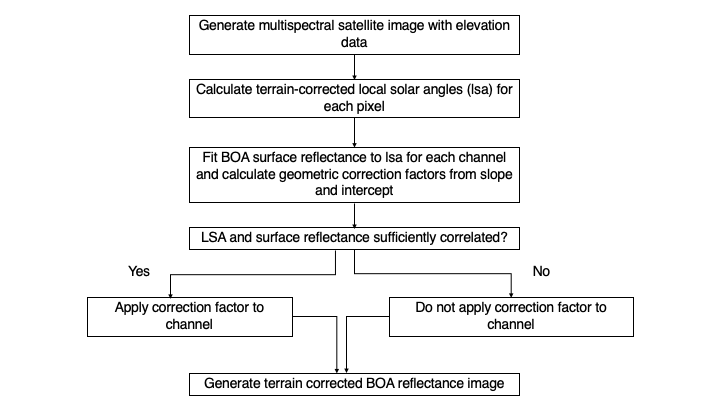
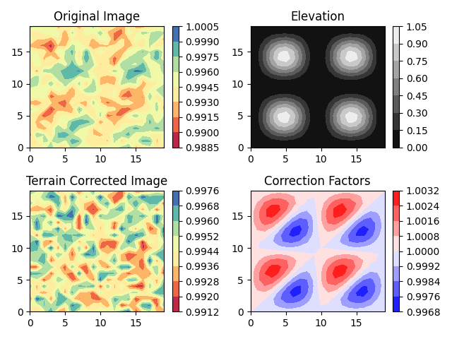

# Illumination Correction on Variable Terrain for Multispectral Satellite Imagery

## Code description
The python code has two scripts, located under `src`:
1. `main.py` - takes a bottom of the atmosphere satellite image and does an illumination correction on it.
2. `utils.py`  - has utilities for generating an artificial bottom of the atmosphere multispectral image with elevation data.

Python version is `3.10.2` and the libraries used are listed in `requirements.txt`. To run the code, do 
```
python src/main.py
```
The output is the image file `results_summary.png` at the top level directory.

## Theory

### A simple Lambertian-based correction
The implementation uses the semi-empirical "C correction" from Teillet et al., 1982. The next subsection discusses more sophisticated models. The basic idea is that for a Lambertian surface, the terrain-corrected reflectance that would be observed if a surface is flat is given by:

$I_h = I_s \frac{cos \theta _z}{cos \gamma}$

where
$I_h$ is the flat surface reflectance, $I_s$ is the bottom of the atmosphere reflectance measured from the sloping surface, $\theta _z$ is the solar zenith angle and $\gamma$ is the terrain-corrected local solar zenith angle. $\gamma$ is calculated as 


$cos \gamma=cos \theta _s cos \theta _z+sin \theta _s sin \theta _z cos(\phi _z− \phi _s)$

where $\theta _s$ is the slop angle, $\phi _s$ is the slope azimuth or aspect, $\phi _z$ is the solar azimuth.

For steep terrains, the denominator blows up, leading to over-corrections. The C-correction rectifies this issue by adding a factor to the ratio:

$I_h = I_s \frac{cos \theta _z + c}{cos \gamma + c}$

This factor is calculated by a linearly fitting the BOA reflectance to the cosine of the terrain slope:

$I_s = mcos \gamma + b$

and taking the ratio of the intercept to the slope:

$c = \frac{b}{m}$

Note that the reflectance should be separately fit for each channel and each different surface type. Furthermore, the correction should only be applied when there is a significant correlation between $cos \gamma$ and $I_t$. While the original paper also proposes that an exponent $q$ be used to account for non-Lambertian behavior (i.e., fit to $cos^q \theta$ instead of $cos \theta$), recent papers still seem to use the basic version as a benchmark against more sophisticated kernel BRDF methods (e.g., Jia et al., 2020)

### Using actual BRDFs
As an aside, much more sophisticated methods (see Vermote et al., 2009, Roy et al., 2016) which account for different types of scattering and geometric effects, are used to correct well-known satellite surface reflectance products such as MODIS or Landsat. In essence, these models fit parameters for different empirical scattering functions each representing a different physical effect for a given spectral range and surface type, much like what we've done above. The assumption is that bottom of atmosphere reflectance can be represented by three terms for a given solar, viewing and azimuthal angle called the Ross-Li-Maignan BRDF model:

$I(\theta _v,\theta _z, \phi) = k_0 + k_1F_1(\theta _v,\theta _z, \phi) + k_2F_2(\theta _v,\theta _z, \phi)$

$F_1$ and $F_2$ are called the volume scattering kernel and the geometric kernel respectively and only depend on the solar and look geometry. The $k$ parameters need to be retrieved by fitting to the data. For Landsat, you can find these values in published papers, for instance see Table 5 of Roy et al., 2016 which lists these parameters for soil and vegetation surface types for visible and IR bands. For your own satellite, once you retrieve the parameters using look geometry (including terrain corrections), you can then use the above BRDF equation to bring the values into nadir view. I have not attempted to implement these models because of time constraints but it is doable.

## Methodology

The flowchart below summarizes the process.


### Data generation

The artificial image is 20x20 pixels in extent with 10 channels. It comes with an elevation map, with associated slope and aspect. The image is assumed to be small enough that the solar and viewing angles do not vary significantly across pixels. Currently, the image contains four mountain like shapes (see the top right panel of figure below for a visualization). It is created by the `generate_image` function in the `utils.py` script. The reflectance values in this image are not fully random, but a summation of random values with the terrain-corrected solar zenith angle. This is necessary because the image correction algorithm requires some threshold correlation between the terrain and brightness values. It is also for this reason that the solar angles are passed into the image generation function. It is assumed that all pixels in the image represent the same surface type.

### Image correction

The image correction is performed in the function `apply_c_correction` in `main.py`. It takes the generated BOA image, does a linear regression of reflectance versus slope corrected solar zenith angle for each channel in the image. For channels with a correlation above threshold between these two variables (here set to 0.5), a correction factor is calculated and applied as described in the theory section above. The original image, corrected image, elevation and the correction factors are then displayed in an image titled `results_summary.png` (see Figure 1.) The viewing angle does not matter for this procedure since the surfaces are Lambertian-like. The solar azimuth and zenith angles can also be changed in `main.py` to see variations.




### References

1. Teillet, P. M., Guindon, B., & Goodenough, D. G. (1982). On the slope-aspect correction of multispectral scanner data. Canadian Journal of Remote Sensing, 8(2), 84-106. [link](http://dx.doi.org/10.1080/07038992.1982.10855028)

2. Jia, W., Pang, Y., Tortini, R., Schläpfer, D., Li, Z., & Roujean, J. L. (2020). A kernel-driven BRDF approach to correct airborne hyperspectral imagery over forested areas with rugged topography. Remote Sensing, 12(3), 432. [link](https://doi.org/10.3390/rs12030432)

3. Vermote, E., Justice, C. O., & Bréon, F. M. (2008). Towards a generalized approach for correction of the BRDF effect in MODIS directional reflectances. IEEE Transactions on Geoscience and Remote Sensing, 47(3), 898-908. [link](https://doi.org/10.1109/TGRS.2008.2005977)

4. Roy, D. P., Zhang, H. K., Ju, J., Gomez-Dans, J. L., Lewis, P. E., Schaaf, C. B., ... & Kovalskyy, V. (2016). A general method to normalize Landsat reflectance data to nadir BRDF adjusted reflectance. Remote Sensing of Environment, 176, 255-271. [link](https://doi.org/10.1016/j.rse.2016.01.023)
